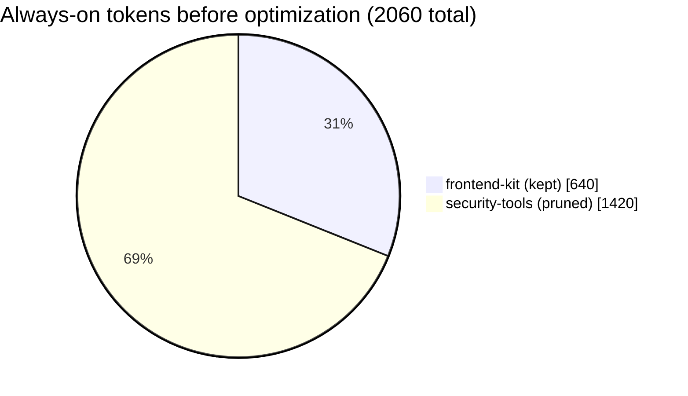
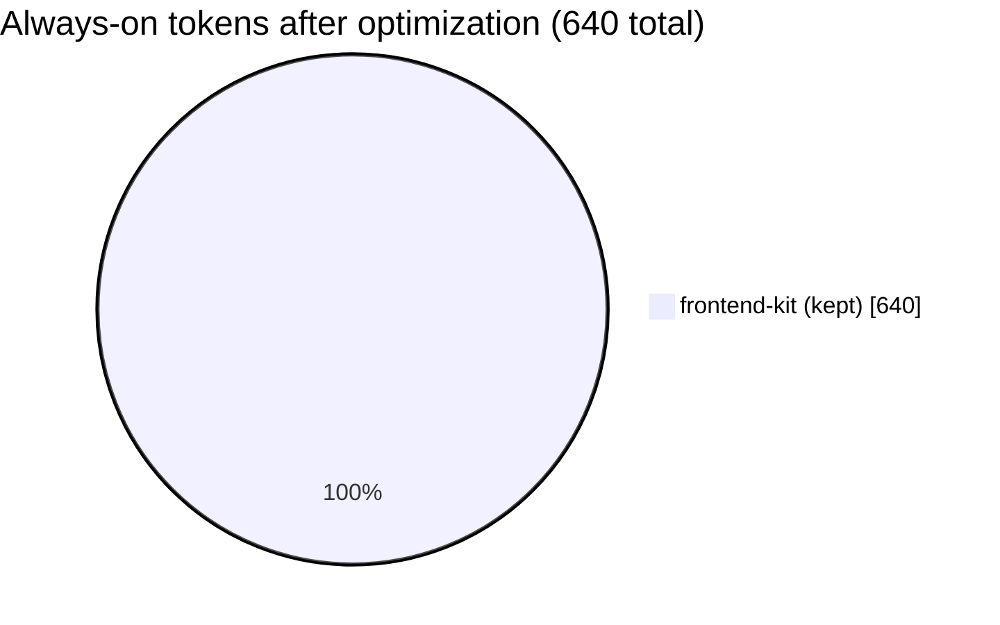
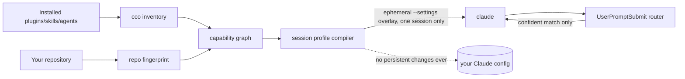

<picture>
  <source media="(prefers-color-scheme: dark)" srcset="assets/banner-dark.svg">
  
</picture>

# CCO — Claude Capability Optimizer

**CCO (Claude Capability Optimizer)** is an unofficial, open-source companion for [Claude Code](https://claude.com/claude-code) that trims the token cost of your installed plugins/skills/agents/MCP servers **before** a session starts, and routes each prompt to only the capabilities it actually needs — without ever touching your existing Claude Code configuration.

[](LICENSE)
[](package.json)
[](https://github.com/brutalstein/cco/actions/workflows/ci.yml)
[](#non-affiliation)

---

## The problem

Every plugin, skill, agent and MCP server you install in Claude Code adds always-on context to *every single session*, whether that session needs it or not. A Rust backend session still pays for your frontend design plugin. A quick doc fix still pays for your full security-audit toolkit. That tax compounds across every prompt, in every repo, forever — and there's no built-in way to see it, let alone reduce it safely.

## What CCO does

- **Inventories** everything installed — plugins, skills, agents, hooks, MCP/LSP servers — and pulls Claude's own projected token-cost numbers where available.
- **Fingerprints your repository** (languages, frameworks, manifests) from metadata only — no source code is uploaded or indexed.
- **Compiles a conservative session profile** before Claude starts: keep what's plausibly relevant, prune what clearly isn't, and when it's not sure, it **keeps** the capability rather than guessing.
- **Routes each prompt** at runtime to the most relevant *already-enabled* capability using a fast, local, deterministic classifier — no extra LLM call, no added latency budget beyond a hard 100ms ceiling.
- **Never trades quality for tokens silently.** Aggressive pruning only ever becomes the default for a task family once it's backed by a measured non-inferiority benchmark; otherwise CCO falls back to native behavior.

## Zero-friction, zero-risk integration

This is the part that matters most:

- `cco run` **never modifies `~/.claude/settings.json`**, project settings, or the persistent installed-plugin state. Every optimization is delivered through a temporary `--settings` overlay passed to one `claude` invocation; the overlay is removed when that session ends.
- That session-only overlay may set a baseline-enabled plugin to `false` for the current invocation. CCO never persistently disables it and never enables a baseline-disabled plugin automatically. The explicit `cco init` command only installs/enables CCO itself.
- Nothing CCO does can widen permissions. The settings overlay is structurally forbidden from touching a `permissions` key at all — this is enforced by a release-blocking test, not a convention.
- If anything about your environment looks even slightly uncertain, CCO falls back to native Claude Code behavior instead of guessing. You can also just... not run it. Your existing setup is completely unaffected either way.
- The CLI (`cco`) is entirely optional and external. The companion plugin (`cco init`) is *additive only* — it adds one new plugin to your list, it never edits, disables, or reorders anything already there.

Verified in practice: running `cco run` against a real Claude Code install with a live plugin set (10 third-party plugins already installed) produced a byte-identical `settings.json` and an unchanged `claude plugin list` before and after the session.

## Install

**Recommended — two commands, no clone, no build step.** Claude Code can add
this repo as a plugin marketplace and install directly from GitHub:

```bash
claude plugin marketplace add brutalstein/cco
claude plugin install cco@cco
```

That's it. This has been run end-to-end against a real GitHub clone (not just
a local path) with a genuine Claude Code CLI install — `claude plugin list
--json` shows zero errors afterward, and the plugin's own manifest passes
`claude plugin validate --strict`. It only ever *adds* one entry to your
plugin list; it does not touch, reorder, or disable anything already there
(see [Zero-friction, zero-risk integration](#zero-friction-zero-risk-integration)).

Building from source (for the `cco` CLI itself, or to contribute):

```bash
git clone https://github.com/brutalstein/cco.git
cd cco
npm ci
npm run build         # tsc -b across all workspaces
npm test               # vitest run
npm run build:plugin   # bundles plugin/cco/bin/cco-hook.mjs with esbuild
```

## Quickstart

```bash
node apps/cli/dist/main.js doctor     # compatibility check against your installed Claude Code
node apps/cli/dist/main.js inventory  # what's installed, and its projected token cost
node apps/cli/dist/main.js analyze    # dry-run: what would be kept/pruned, and why — nothing launches
node apps/cli/dist/main.js run        # launch Claude with an ephemeral, optimized --settings overlay
```

`cco init` checks Claude Code, creates owner-restricted local CCO state, and idempotently installs only the CCO companion plugin from the versioned `brutalstein/cco` marketplace. Use `--plugin-source <source>` to select an approved mirror or local marketplace. It never installs, disables, or reorders unrelated plugins.

## Real numbers, not marketing copy

Every number below comes from running actual, committed code against
committed fixtures — reproduce it yourself with `node scripts/demo-savings.mjs`,
no live Claude call or hand-edited number involved.

**Scenario:** a real TypeScript/React/Vite repository fixture, with two
plugins installed: `frontend-kit` (relevant) and `security-tools`
(irrelevant to this repo, no dependency, no matching tag).





| Plugin | Decision | Reason code | Why |
|---|---|---|---|
| `frontend-kit@example` | **KEEP** | `KEEP_HIGH_REPO_AFFINITY` | its auto-extracted `domain:frontend-ui` tag matches this repo's fingerprinted domain |
| `security-tools@example` | **PRUNE** | `PRUNE_STRUCTURAL_IRRELEVANCE` | no repository or task affinity, and nothing else depends on it |

**Result: 2060 → 640 always-on tokens, a 69% reduction**, for this repo/plugin
combination — computed by the same `DefaultProfileCompiler` that ships in
`packages/core`, not a separate demo-only code path.

Reductions vary by repo and installed plugin set: a repo whose plugins are
*all* relevant sees ~0% reduction (correct — there's nothing safe to prune),
while a large generic plugin set on a narrow single-purpose repo can see
much more. CCO reports the real number for *your* environment via
`cco analyze`; the number above is one concrete, reproducible example.

**CCO's own footprint**, from `claude plugin details cco@cco` against the
actual installed plugin (not an estimate):

| | |
|---|---|
| Always-on cost | **~246 tokens** |
| Skills | 4 (`status`, `explain`, `audit`, `profile`) — user-invoked only |
| Hooks | 3 (`SessionStart`, `UserPromptSubmit`, `SessionEnd`) — harness-only, no model context cost |
| Agents / MCP servers / LSP servers | 0 / 0 / 0 |

The companion plugin you install to get per-prompt routing costs less than a
tenth of the single irrelevant plugin it helped prune in the example above.

### Verified against a real, live Claude Code install

Two things worth being explicit about, because "unofficial and unbenchmarked"
is a common way these projects quietly lie:

- **Cost data comes from the real CLI, parsed correctly.** `claude plugin
  details <id>` has no `--json` mode on the currently installed CLI (only
  `-h/--help`) — CCO parses its human-readable output instead
  (`packages/claude-adapter/src/plugin-details.ts`), including locale-grouped
  numbers like `~1.420 tok`. This was verified end-to-end against 11 real,
  independently-installed plugins on a live machine, not just against
  fixtures.
- **A smoke benchmark suite has actually been run against a live `claude` binary**,
  not just designed. `benchmarks/suites/simple-utility-v1` ran a real
  single-file edit task through `claude -p`, baseline vs a CCO-compiled
  profile, 2 trials per arm: both arms completed the task correctly in every
  trial. Under the current qualification policy, two trials are smoke evidence
  only and cannot promote pruning or support a general non-inferiority claim. The raw result is published at
  `benchmarks/published/simple-utility-v1-run_56a34bbd3db70084/summary.json`
  — see `BENCHMARKS.md` for what it does and doesn't show yet.

## How it fits together



| Path | Owns |
|---|---|
| `apps/cli` | the `cco` CLI — orchestration only, no duplicated logic |
| `packages/platform` | OS paths, atomic file I/O, process launching |
| `packages/claude-adapter` | all Claude-CLI-version-specific parsing/contracts |
| `packages/core` | the actual product logic: capability graph, profile compiler, router, optimizer, quality gate, local telemetry |
| `packages/report` | human-readable rendering of CLI output |
| `packages/benchmark` | isolated baseline-vs-candidate benchmark harness |
| `plugin/cco` | the minimal, self-contained Claude Code plugin |

See `ARCHITECTURE.md` for the fuller breakdown.

## Design principles

1. Never weaken Claude Code permissions.
2. Never silently enable an extension you had disabled.
3. Never mutate your Claude settings as part of ordinary `cco run`.
4. Never execute third-party extension code during inventory or audit.
5. Never claim quality preservation from intuition — a non-inferiority benchmark backs every aggressive default, or it falls back to native.
6. Don't churn plugin/tool sets per turn; a stable session prefix is a first-class goal.
7. Cooperate with Claude's native MCP Tool Search instead of reimplementing it.
8. Telemetry is local-only, secret-redacted, and never leaves your machine.
9. When uncertain, abstain from optimization rather than remove a capability.

## Status

Core packages build clean and are unit-tested (101 tests across 22 files, including the labeled router corpus, compiler fixture matrix, launcher lifecycle, hook integrity/performance, deep-audit, benchmark-isolation, and release-safety suites — see `docs/CLAIMS.md`). `doctor`/`inventory`/`analyze`/`audit`/`run` have been exercised against a real Claude Code install with real installed plugins. The `brutalstein/cco` marketplace and `cco@cco` plugin install path is verified end-to-end from a live GitHub clone, and one smoke benchmark suite has been run against a live `claude` binary. The last published commit was green on ubuntu-latest, windows-latest, and macos-latest; the current release diff must pass the same matrix before publication. npm publication and multi-family public-claim-grade benchmarking remain external gates.

## Contributing

See `CONTRIBUTING.md`. Security issues: see `SECURITY.md` — please don't file those as public issues.

## Non-affiliation

CCO is an independent, unofficial project. It is **not** built, endorsed, or supported by Anthropic. "Claude" and "Claude Code" are used only to describe compatibility.

## License

[Apache License 2.0](LICENSE) — see `NOTICE` for attribution details.
